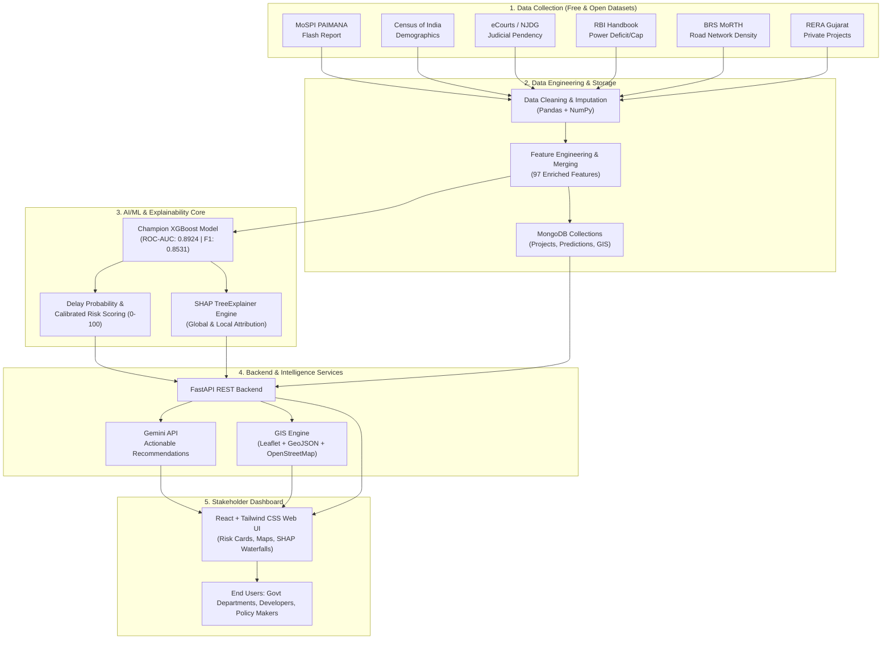

# RiskGuard 🛡️
### AI-Powered Infrastructure Project Delay Prediction and Risk Assessment System
> **"Predict | Explain | Recommend | Visualize | Enable Better Decisions"**

[](https://www.python.org/downloads/)
[](https://xgboost.readthedocs.io/)
[](https://shap.readthedocs.io/)
[](https://www.mongodb.com/)
[](https://fastapi.tiangolo.com/)
[](https://react.dev/)
[](tests/)

---

## 📌 Executive Summary

Major infrastructure and land acquisition projects frequently face severe schedule slippages, compounding budget overruns, and administrative bottlenecks. **RiskGuard** is an end-to-end, data-driven intelligence platform designed to:
1. **Predict** schedule delays across central and state infrastructure initiatives before they compound.
2. **Quantify** project vulnerability into calibrated risk scores ($0 - 100$) and operational tiers (`LOW`, `MEDIUM`, `HIGH`).
3. **Explain** individual predictions using exact **SHAP (Shapley Additive exPlanations)** feature attribution.
4. **Recommend** actionable, domain-specific mitigation steps via the **Google Gemini API**.
5. **Visualize** national and regional project trajectories through an interactive **Leaflet + GeoJSON GIS Dashboard**.

---

## 🏗️ System Architecture & Workflow



---

## 🛠️ Technology Stack

| Layer | Technology | Operational Purpose |
|:---|:---|:---|
| **Frontend** | `React` + `Tailwind CSS` | Modern, responsive dashboard featuring project cards, trend charts, and explanation panels. |
| **GIS Engine** | `Leaflet` + `GeoJSON` + `OpenStreetMap` | Geospatial mapping of infrastructure sites, state-level risk choropleths, and dispute clusters. |
| **Backend** | `FastAPI` + `Pydantic` | High-performance asynchronous RESTful APIs connecting the database, ML engine, and UI. |
| **Database** | `MongoDB` | Document-oriented persistence for project records, spatial coordinates, predictions, and logs. |
| **AI / ML** | `Scikit-Learn` + `XGBoost` | Feature preprocessing pipeline and gradient boosted trees for high-precision delay classification. |
| **Explainable AI (XAI)** | `SHAP (TreeExplainer)` | Mathematically rigorous Shapley value attribution for both global insights and individual projects. |
| **Recommendation Engine** | `Google Gemini API` | Generative reasoning for context-aware risk mitigation strategies and executive summaries. |
| **Data Processing** | `Pandas` + `NumPy` + `pdfplumber` | Robust PDF tabular parsing, statistical imputation, feature extraction, and pipeline normalization. |
| **Containerization** | `Docker` + `docker-compose` | Reproducible deployment and container orchestration across environments. |

---

## 👥 Team Structure: 6 Members — 3 Pairs

The RiskGuard engineering workflow is structured into 3 collaborative pairs across 6 distinct specializations:

```
┌────────────────────────────────────────────────────────────────────────┐
│                        6 MEMBERS — 3 PAIRS                             │
├───────────────────┬───────────────────┬────────────────────────────────┤
│      PAIR 1       │      PAIR 2       │             PAIR 3             │
│ Data Engineering  │  AI / ML & XAI    │   Application, GIS & Gemini    │
├───────────────────┼───────────────────┼────────────────────────────────┤
│ Member 1:         │ Member 3:         │ Member 5:                      │
│ Data Acquisition  │ Machine Learning  │ Backend & Gemini API           │
│                   │                   │                                │
│ Member 2:         │ Member 4:         │ Member 6:                      │
│ Processing & DB   │ Risk & SHAP       │ Frontend & Leaflet GIS         │
└───────────────────┴───────────────────┴────────────────────────────────┘
```

### Pair 1: Data Collection & Data Engineering
- **Member 1 — Data Acquisition**:
  - Identified and ingested free, open, and reliable government repositories.
  - Sourced primary infrastructure monitoring data from **MoSPI PAIMANA** (Flash Report March 2026).
  - Enriched with **Census 2011** demographics, **eCourts / NJDG** litigation backlogs, **RBI** power deficits, and **BRS MoRTH** road statistics.
  - Established data provenance and feature requirements.
- **Member 2 — Data Processing & Database**:
  - Implemented multi-format parsers (PDF, Excel, CSV) and cleaned 1,941 central projects.
  - Handled missing values, outliers, and geographic standardization across Indian states.
  - Engineered 65+ domain features (progress-to-expenditure gap, cost overrun ratio, judicial clearance index).
  - Designed the **MongoDB** schema and produced the normalized master dataset (`riskguard_master.csv`).

### Pair 2: AI/ML & Explainable AI
- **Member 3 — Machine Learning**:
  - Defined the binary classification target (`target_delayed`: schedule slippage > 0 days).
  - Built stratified train/test partitions ($N=1,552$ train, $N=389$ test).
  - Trained, cross-validated, and fine-tuned **Logistic Regression**, **Random Forest**, and **XGBoost**.
  - Benchmarked models and selected `XGBoostClassifier` as the production champion (ROC-AUC: 0.8924).
- **Member 4 — Risk Analysis & SHAP**:
  - Built the calibrated risk-scoring engine ($0 - 100$) and defined operational risk boundaries (`LOW`, `MEDIUM`, `HIGH`).
  - Integrated `shap.TreeExplainer` with verified local additivity ($E[f(x)] = 0.4799$).
  - Extracted global delay drivers and generated top 5 positive/negative feature attributions per project.
  - Formulated objective, non-causal human-readable explanation narratives.

### Pair 3: Application, GIS & AI Recommendations
- **Member 5 — Backend & Gemini Integration**:
  - Develops the **FastAPI** RESTful application and handles secure **MongoDB** database connections.
  - Exposes endpoints for single-project and batch delay inference (`/predict`, `/risk-analysis`, `/shap-explanation`).
  - Integrates the **Gemini API** to convert identified SHAP risk drivers into actionable project mitigation steps.
- **Member 6 — Frontend & GIS**:
  - Builds the responsive **React** and **Tailwind CSS** user dashboard.
  - Implements **Leaflet + GeoJSON** maps for nationwide geographic exploration and district-level risk overlays.
  - Visualizes real-time delay trends, risk categorization badges, and interactive SHAP waterfall/force plots.

---

## 📊 Machine Learning Performance & Benchmarks

All models were tuned via 5-fold cross-validation on the training set and evaluated on the identical, untouched test set ($N=389$):

| Model | Accuracy | Precision | Recall | F1-Score | ROC-AUC | Production Role |
|:---|:---:|:---:|:---:|:---:|:---:|:---:|
| **Logistic Regression** | 79.69% | 0.8108 | 0.8750 | 0.8417 | 0.8641 | Linear Baseline |
| **Random Forest** | 79.95% | 0.8022 | **0.8958** | 0.8465 | 0.8785 | Non-linear Candidate |
| **XGBoost (Champion)** | **81.23%** | **0.8249** | 0.8833 | **0.8531** | **0.8924** | 🏆 **Production Model** |

### Why XGBoost Won:
- **Peak Discriminative Power**: ROC-AUC of **0.8924** indicates superior ranking capability across decision thresholds.
- **Balanced Sensitivity**: High recall (88.33%) ensures delayed projects are flagged early without incurring excessive false alarms (precision: 82.49%).
- **Non-Linear Interaction Modeling**: Accurately maps complex cross-domain couplings between judicial backlog, power deficits, and expenditure spikes.

---

## 🎯 Risk Scoring & Calibrated Categories

$$\text{Risk Score} = \text{clamp}(P(\text{delay} \mid x), 0.0, 1.0) \times 100$$

### Portfolio Distribution ($N=1,941$ Infrastructure Projects)

| Risk Category | Score Range | Count | Percentage | Operational Action Required |
|:---:|:---:|:---:|:---:|:---|
| 🟢 **LOW** | $[0.0, 35.0)$ | 562 | **28.95%** | Routine monitoring; balanced milestone and expenditure pace. |
| 🟡 **MEDIUM** | $[35.0, 65.0)$ | 284 | **14.63%** | Watchlist status; proactive review of contractor deliverables and approvals. |
| 🔴 **HIGH** | $[65.0, 100.0]$ | 1,095 | **56.41%** | Priority intervention; budget audit, fast-tracked land disputes, scope re-alignment. |

---

## 🔍 Explainable AI (SHAP Insights)

RiskGuard integrates `shap.TreeExplainer` on the champion model to ensure every risk score is fully transparent, auditable, and mathematically grounded.

### Top Global Delay Drivers (by Mean Absolute SHAP)

```
physical_progress                       ████████████████████ 0.9761
planned_duration_days                   ███████████ 0.5205
expenditure_ratio                       ███████ 0.3389
expenditure                             ████ 0.1742
cost_overrun                            ███ 0.1562
revised_cost                            ███ 0.1415
original_cost                           ███ 0.1264
state_subordinate_courts_cases_pending  ██ 0.0892
state_annual_per_capita_availability    ██ 0.0826
state_power_energy_deficit_percent      █ 0.0631
```

### Domain Alignment Verification
- **Physical-Financial Gap**: Projects with surging expenditures but lagging physical completion have the strongest positive SHAP contribution toward delay risk.
- **Longer Schedule Windows**: Extended planned durations carry compounding probabilities of contractor turnover, environmental challenges, and scope shifts.
- **External Risk Context**: State-level court backlogs and regional power deficits rank in the top 10 delay factors, confirming that multi-source contextual data provides significant predictive signal.

---

## 📂 Repository Structure

```
RiskGuard/
│
├── frontend/                     # React + Tailwind CSS Web Application
│   ├── src/                      # UI components, pages, charts
│   ├── public/                   # Static assets
│   └── package.json              # Frontend dependencies
│
├── backend/                      # FastAPI REST Application
│   ├── app/                      # API routers, schemas, dependencies
│   │   ├── routers/              # /projects, /predict, /explain, /recommend
│   │   ├── services/             # ML inference, Gemini API, DB clients
│   │   └── main.py               # Application entrypoint
│   └── Dockerfile
│
├── data/                         # Multi-Source Datasets
│   ├── raw/                      # Original raw sources (read-only)
│   │   ├── paimana/              # MoSPI PAIMANA Flash Report PDF
│   │   ├── census/               # Census 2011 demographic data
│   │   ├── court/                # NJDG / eCourts judicial backlog data
│   │   ├── power/                # RBI state power requirements & deficits
│   │   ├── roads/                # BRS MoRTH road connectivity statistics
│   │   └── private_property/     # Gujarat RERA private project records
│   ├── interim/                  # Extracted and normalized tables
│   └── processed/
│       └── master/               # riskguard_master.csv (1,941 rows × 65 features)
│                                 # X_train.csv, X_test.csv, y_train.csv, y_test.csv
│                                 # risk_predictions.csv (portfolio scored)
│                                 # project_explanations.json (SHAP profiles)
│
├── models/                       # Serialized Machine Learning Artifacts
│   ├── best_model.pkl            # Production Champion (XGBClassifier)
│   ├── preprocessor.pkl          # Fitted ColumnTransformer (Imputer + Scaler + OHE)
│   ├── logistic_regression.pkl   # Baseline model
│   ├── random_forest.pkl         # Tuned candidate model
│   ├── xgboost.pkl               # Tuned XGBoost model
│   └── model_metadata.json       # Hyperparameters and benchmark metrics
│
├── notebooks/                    # Reproducible Jupyter Experiment Notebooks
│   ├── 01_data_exploration.ipynb
│   ├── 02_data_preprocessing.ipynb
│   ├── 03_feature_engineering.ipynb
│   ├── 04_data_integration.ipynb
│   ├── 05_model_training.ipynb
│   └── 06_model_explainability.ipynb
│
├── src/                          # Modular Core Source Code
│   ├── preprocessing/            # Domain-specific parsers & extractors
│   ├── features/                 # Transformation logic & aggregators
│   ├── models/                   # Training, hyperparameter search, inference
│   │   ├── train.py              # End-to-end model training pipeline
│   │   ├── evaluate.py           # Metric calculation & visualization
│   │   └── predict.py            # Standard inference interface
│   └── explainability/           # Risk Analysis & SHAP Engine
│       ├── risk_analysis.py      # Probability-to-score & category logic
│       └── shap_analysis.py      # TreeExplainer & narrative generator
│
├── gis/                          # Geospatial Resources
│   ├── geojson/                  # State & district boundary GeoJSONs
│   └── maps/                     # Map tile layers & style utilities
│
├── docs/                         # Specifications & Engineering Reports
│   ├── data_dictionary.md        # Comprehensive 65-column specification
│   ├── data_exploration_summary.md
│   ├── mongodb_schema.md         # Document schemas and indices
│   ├── model_evaluation.md       # Full ML benchmark breakdown
│   ├── risk_analysis.md          # Threshold calibration methodology
│   ├── shap_validation.md        # Mathematical & domain validation
│   └── reports/                  # Generated visualization artifacts & plots
│
├── tests/                        # Automated Unit Test Suite
│   └── test_risk_analysis.py     # 10 unit tests for scoring, SHAP, additivity
│
├── requirements.txt              # Core Python dependencies
├── .gitignore                    # Version control exclusions
└── README.md                     # Project documentation
```

---

## ⚡ Quickstart Guide

### 1. Prerequisites
- **Python**: Version `3.10` or higher
- **Node.js**: Version `18+` (for Frontend)
- **MongoDB**: Local community edition or MongoDB Atlas URI

### 2. Clone and Environment Setup
```bash
# Clone the repository
git clone https://github.com/YourTeam/RiskGuard.git
cd RiskGuard

# Create and activate a virtual environment
python -m venv venv
# On Windows:
venv\Scripts\activate
# On Linux/macOS:
source venv/bin/activate

# Install core dependencies
pip install -r requirements.txt
```

### 3. Run Automated Tests
Verify scoring formulas, threshold boundaries, and SHAP local additivity:
```bash
python -m pytest tests/test_risk_analysis.py -v
```

### 4. Execute the Machine Learning Pipeline
```bash
# Train models and select champion
python src/models/train.py

# Evaluate benchmark metrics and generate performance plots
python src/models/evaluate.py

# Compute global & local SHAP explanations and risk scores
python -c "from src.explainability.shap_analysis import run_shap_pipeline; run_shap_pipeline('.')"
```

### 5. Launch Analysis Notebooks
```bash
jupyter notebook notebooks/
```
- `01_data_exploration.ipynb`: Exploratory data analysis across all 6 raw sources.
- `05_model_training.ipynb`: Multi-model hyperparameter tuning and cross-validation.
- `06_model_explainability.ipynb`: Interactive SHAP beeswarm plots and waterfall charts.

---

## 📅 Roadmap & Milestones

- [x] **Phase 1 (Pair 1)**: Data Acquisition, Parsing, Cleaning & Master Dataset Integration.
- [x] **Phase 2 (Pair 1)**: MongoDB Schema Design & Geographic Harmonization.
- [x] **Phase 3 (Pair 2)**: ML Pipeline, Multi-Model Tuning, Evaluation & Champion Selection (`XGBoost`).
- [x] **Phase 4 (Pair 2)**: Risk Scoring, Threshold Calibration, SHAP TreeExplainer & Narrative Generation.
- [ ] **Phase 5 (Pair 3)**: FastAPI REST Endpoints, MongoDB Atlas Ingestion & Gemini API Recommendations.
- [ ] **Phase 6 (Pair 3)**: React Dashboard, Tailwind UI, Leaflet GIS Map Visualization & Docker Deployment.

---

## 📜 License
Distributed under the **MIT License**. See `LICENSE` for details.

---

## 🤝 Acknowledgements
- **Ministry of Statistics and Programme Implementation (MoSPI)** for the PAIMANA Project Monitoring Flash Reports.
- **National Judicial Data Grid (NJDG) / eCourts** for judicial pendency indicators.
- **Census of India** and **Reserve Bank of India (RBI)** for demographic and infrastructure data.
